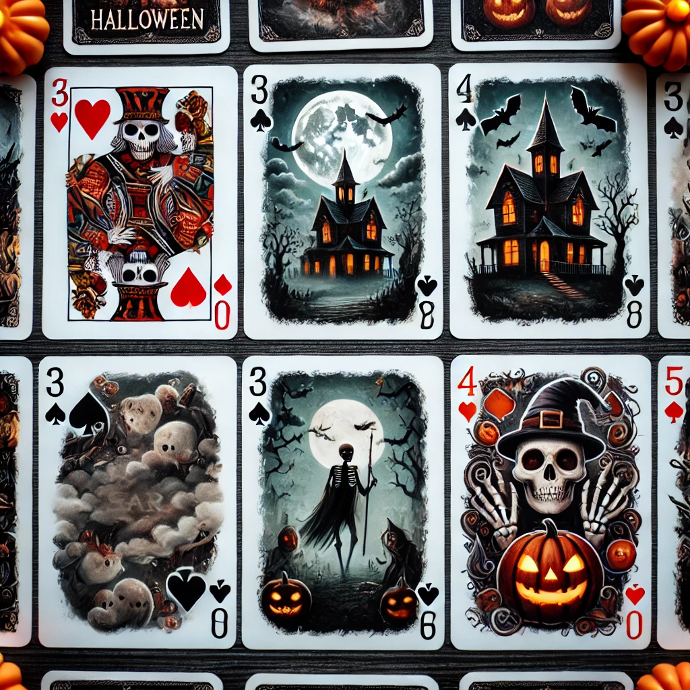
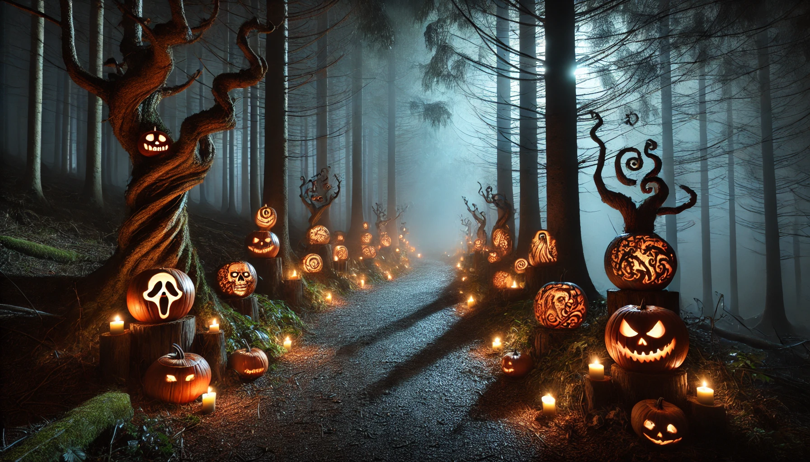

# War Card Game: Halloween Edition 🎃👻

Welcome to the **Halloween Edition** of the classic **War** card game! This spooky twist brings eerie fun as players battle to claim all the haunted cards. Will you survive the night and become the **King of the Graveyard**?

## How to Play

### Setup:
1. **Prepare your haunted deck**: A standard 52-card deck will do, but for extra Halloween fun, use a deck with spooky-themed cards (ghosts, witches, pumpkins!).
2. Split the deck evenly between two players. Each player receives 26 cards.

### Game Rounds:
1. **Each player draws the top card** from their deck and places it face-up, ready for the Halloween showdown.
2. **Compare the cards**:
   - The player with the stronger card wins the round and claims both cards, placing them at the bottom of their deck.
   - The cards' strength is ranked as usual (Ace is the most powerful, 2 is the weakest).

3. **Trick or Treat War**:
   - If the two cards are of equal rank, the haunting begins with a "war":
     1. Both players chant **“Trick or Treat!”** and place three cards face-down.
     2. Each player then draws one face-up card to battle.
     3. The player with the stronger face-up card wins the entire pile (all face-up and face-down cards).
   - If there is another tie, the **war** continues until one player wins the tie.

### Winning:
The spooky battle continues until one player controls the entire haunted deck. They are crowned the **Master of Halloween!**

## Rules Summary:
- Cards are ranked in the usual order (from lowest to highest): 2, 3, 4, 5, 6, 7, 8, 9, 10, Jack, Queen, King, Ace.
- In the event of a tie, a "war" occurs, or as we call it in this Halloween version, **Trick or Treat War**.
- The game ends when one player possesses all the cards.

## Optional Halloween Rules:
1. **Ghost Cards**: Add two special ghost cards to the deck. If a ghost card is drawn, the player automatically wins the round.
2. **Pumpkin Curse**: Players may swap the top card of their deck with their opponent's once per game—perfect for a sneaky Halloween trick!

## Special Edition Items:
- **Spooky Deck**: Use a deck with Halloween-themed illustrations for maximum fun.
- **Costumes Encouraged**: Dress up as witches, vampires, or zombies while you play to get into the Halloween spirit!

## License

This Halloween edition of War is a fun twist on the traditional card game, perfect for spooky gatherings. Feel free to share and modify this game for even more eerie fun!
